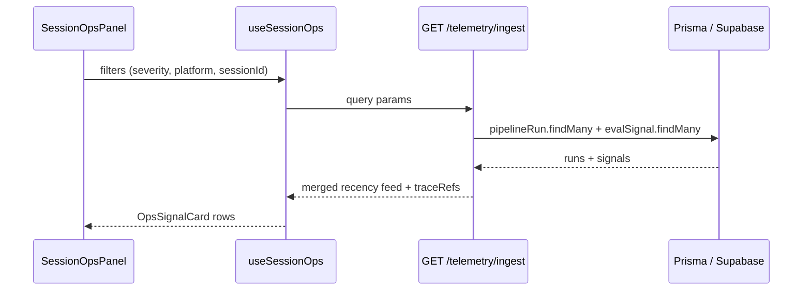

# Observability UI → API → DB sequence

Generated for observability-platform-v2 (Spec 6).

## Filters

| Query param | UI control |
|-------------|------------|
| `severity` | impact dropdown |
| `agent_platform` | platform dropdown |
| `session_id` | session ID text input |
| `tenant_id` | DEV_TENANT_ID default |
| `limit` | page size (max 100) |

## Report path

`yarn telemetry:report` → `telemetry-cli report` → dry-run sync stats (coverage, spans) + `agent-eval-report.mjs` HTML artifact at `reports/observability/latest.html`.

SLO targets (skill): >95% session capture, >99% span flush — surfaced in report SLO section when sync stats available.
