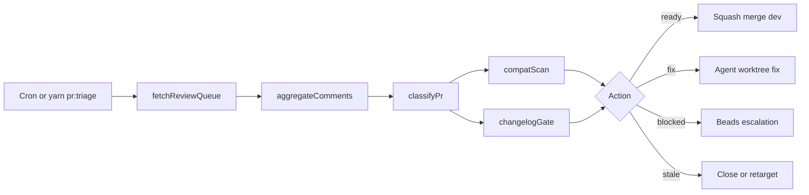

# PR Resolution — Execution Plan

## User journey

## Phases

### Phase 1 — P0 dev PRs (#91 → #90 → #89 → #88)

1. Fix high PS null-safe + CHANGELOG dedupe on #91.
2. Fix doc/link issues on #90.
3. Triage #89, #88; merge if only P3 comments remain.
4. Run `yarn verify:forge` / path-filtered verify per PR.

**Kill criteria:** Phase 1 fails if #91 or #90 retain unresolved **high** AI comments after 2 fix iterations → beads escalation, no merge.

### Phase 2 — Compatibility gate

Run `npx agent-compatibility@latest --json` on repo root and stacks touched by P0 diffs.

**Kill criteria:** Score &lt; 60 on any affected path → merge blocked unless beads override.

### Phase 3 — Stale main PRs (#27–#81)

Batch classify via `scripts/pr-triage/classify-pr.mjs`; post summary to `[PR Triage]` issue.

**Kill criteria:** Abort mass-close if a stale PR has commits not on `dev` (script checks merge-base).

## Stack

| Layer | Choice |
|-------|--------|
| Orchestration | GitHub Actions + `scripts/pr-triage/run-triage.mjs` |
| Review queue | `gh api` + `fetch-review-queue.mjs` |
| Comments | `aggregate-pr-comments.mjs` |
| Changelog | `update-changelog.mjs` + existing validator |
| Escalation | `.agents/templates/pr-escalation.yaml` + beads |

## Immediate next actions

1. `yarn pr:triage` — validate pipeline output.
2. Fix PR #91 review comments; push; re-run `yarn pr:comments --pr 91`.
3. Record compatibility scores in `docs/pr-resolution/compatibility-2026-07-05.md`.
4. Run stale PR classification; update triage issue.
