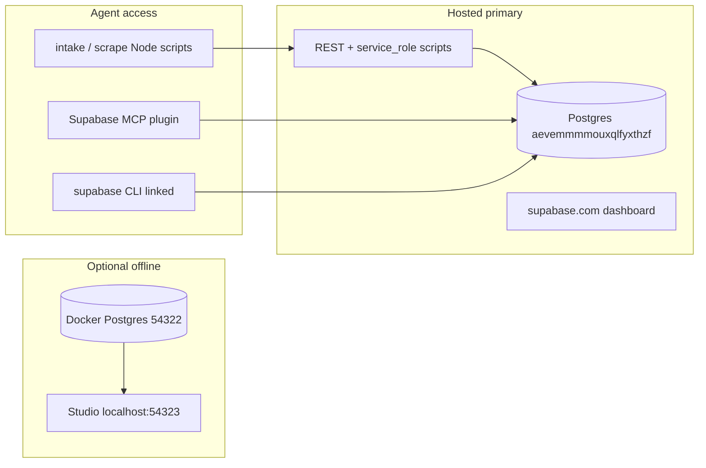

# Supabase hybrid setup — hosted data, agent tooling

ModMe default: **hosted** project `modme-next-forge` (`aevemmmmouxqlfyxthzf`). Optional **local Docker** stack for offline experiments only. Do not mix URLs and keys across targets.

ADR: [`next-forge/docs/adr/0002-cloud-first-supabase-with-prisma.md`](../next-forge/docs/adr/0002-cloud-first-supabase-with-prisma.md)

---

## Architecture



| Target | When to use | Dashboard |
|--------|-------------|-----------|
| **Hosted** | Production intake, scrape pipeline, Knowledge UI, agents | [Cloud dashboard](https://supabase.com/dashboard/project/aevemmmmouxqlfyxthzf) |
| **Local Docker** | Offline dev, destructive experiments | http://127.0.0.1:54323 (after `yarn supabase:local:setup`) |

There is no local Studio for hosted Postgres — use the **cloud dashboard** for hosted data. Local Studio only inspects the Docker stack.

---

## One-time hosted setup

```powershell
# From repo root
.\scripts\ensure-cloud-supabase-env.ps1

# Link CLI (once)
cd next-forge\packages\database
bunx supabase login --token sbp_<account-token>
bunx supabase link --project-ref aevemmmmouxqlfyxthzf --workdir ..\.. --dns-resolver https --yes

# Apply SQL migrations (Prisma tables already exist on cloud)
bunx supabase db push --workdir ..\.. --dns-resolver https --yes
```

Set keys in root `.env` from [API settings](https://supabase.com/dashboard/project/aevemmmmouxqlfyxthzf/settings/api):

```env
NEXT_PUBLIC_SUPABASE_URL=https://aevemmmmouxqlfyxthzf.supabase.co
SUPABASE_SERVICE_ROLE_KEY=<service_role from dashboard>
NEXT_PUBLIC_SUPABASE_PUBLISHABLE_KEY=<publishable or anon>
```

**Do not** run `yarn supabase:local:env` after cloud setup — it overwrites root `.env` with `127.0.0.1`.

If that happens: `node scripts/fix-cloud-supabase-url.mjs` then re-paste the **cloud** service_role key.

---

## Agent workflows (edit / extend / run)

| Tool | Use for |
|------|---------|
| **Supabase MCP** (Cursor plugin) | `list_tables`, `execute_sql`, `get_advisors`, migrations review |
| **Supabase CLI** (linked) | `db push`, `migration list`, edge functions deploy |
| **Node scripts** (service role) | `yarn intake`, `yarn scrape:*` |
| **Prisma** (`next-forge`) | App API reads via `@repo/database` |

Security (hosted + agents):

- Scripts and agents use **`SUPABASE_SERVICE_ROLE_KEY`** only in server-side / CLI context — never `NEXT_PUBLIC_*`.
- Scrape tables have **RLS enabled**; service role bypasses RLS for pipeline writes.
- Run **`get_advisors`** after schema changes (security + performance).
- Avoid `prisma db push --accept-data-loss` on cloud — it would drop non-Prisma tables (`copilot_*`, etc.).

---

## Optional local stack (hybrid dev)

Use when you need a **local dashboard** or offline work:

```powershell
yarn supabase:local:setup   # Docker + Studio at :54323
yarn intake:dry-run         # against local only
```

Switch back to hosted before shared/agent work:

```powershell
.\scripts\ensure-cloud-supabase-env.ps1
# Re-apply cloud service_role if needed
```

Keep **separate** env files mentally: local sync writes `127.0.0.1`; cloud uses `aevemmmmouxqlfyxthzf.supabase.co`.

---

## Edge functions (future)

Deploy to **hosted** from linked project:

```powershell
cd next-forge\packages\database
bunx supabase functions deploy <name> --workdir ..\.. --dns-resolver https
```

Local function testing:

```powershell
cd next-forge
bun run db:start
bunx supabase functions serve --workdir . --dns-resolver https
```

---

## Verify hosted scrape pipeline

```powershell
.\scripts\ensure-cloud-supabase-env.ps1
yarn supabase:env:diagnose
node scripts/scrape-promote.mjs --dry-run
node scripts/scrape-classify.mjs --dry-run
.\scripts\run-scrape-pipeline.ps1 -Manifest docs-sitemap -DryRun
```

---

## Related docs

- [`docs/supabase-cloud-setup.md`](supabase-cloud-setup.md) — keys and migrations
- [`docs/supabase-setup.md`](supabase-setup.md) — local vs cloud commands
- [`docs/inbox-pipeline/README.md`](inbox-pipeline/README.md) — scrape intake section
