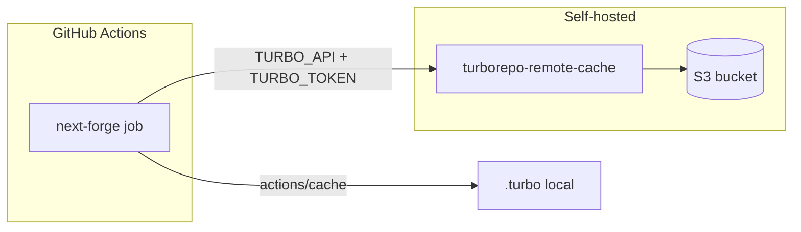

# Self-hosted Turbo remote cache (S3)

> **Operator index:** [monorepo-build-ci-setup.md](monorepo-build-ci-setup.md) — dual-stack boundaries, local `next-forge/.env` vs GitHub `vars`/`secrets`, full checklist. **ADR:** [ADR-0011](../next-forge/docs/adr/0011-turbo-self-hosted-remote-cache.md). **Automation:** `yarn setup:turbo-cache`.

ModMe uses **two layers** of Turborepo caching in CI:

| Layer | Scope | Setup |
|-------|--------|--------|
| **GHA `actions/cache`** on `.turbo` | Per-branch, per-lockfile | Already wired in `ci.yml` and `catalog-ci.yml` |
| **Remote cache (S3)** | Cross-machine, cross-PR | Optional — this guide |

When remote secrets are unset, Turbo logs a warning and falls back to the GHA `.turbo` cache only. No CI breakage.

---

## Architecture



**Server:** [ducktors/turborepo-remote-cache](https://github.com/ducktors/turborepo-remote-cache) — open-source API compatible with Turborepo’s remote cache protocol, with S3 (or local disk) backend.

**Client:** Turbo 2.8 in `next-forge/` reads:

| Variable | Purpose |
|----------|---------|
| `TURBO_API` | Base URL of your cache server (no trailing slash), e.g. `https://turbo-cache.modme.internal` |
| `TURBO_TOKEN` | Bearer token — must match server `TURBO_TOKEN` |
| `TURBO_TEAM` | Team slug (any stable string, e.g. `modme`) |
| `TURBO_REMOTE_CACHE_SIGNATURE_KEY` | Optional; required when `remoteCache.signature: true` in `turbo.json` — same value on server and CI |

---

## 1. S3 bucket

1. Create a private bucket, e.g. `modme-turbo-cache` (versioning optional).
2. IAM user or role with `s3:PutObject`, `s3:GetObject`, `s3:DeleteObject`, `s3:ListBucket` on that bucket.
3. Block public access.

---

## 2. Run the cache server

### Quick start (Docker Compose)

From repo root:

```powershell
cd scripts/turbo-remote-cache
Copy-Item env.example .env
# Edit .env — set S3 credentials and TURBO_TOKEN (long random string)
docker compose up -d
```

Health check (with token):

```bash
curl -H "Authorization: Bearer $TURBO_TOKEN" "$TURBO_API/v8/artifacts/status"
```

Expect `{"status":"enabled",...}`.

### Production notes

- Put the service behind HTTPS (reverse proxy / internal load balancer).
- Restrict network access to CI runners and developer VPN.
- Rotate `TURBO_TOKEN` periodically; update GitHub secrets and server env together.
- For signed caches, set `TURBO_REMOTE_CACHE_SIGNATURE_KEY` to the same 32+ char secret on server and in GitHub.

---

## 3. GitHub repository configuration

### Variables (Settings → Secrets and variables → Actions → Variables)

| Variable | Example |
|----------|---------|
| `TURBO_REMOTE_CACHE_ENABLED` | `true` when remote cache is live; omit or `false` for GHA `.turbo` only |
| `TURBO_API` | `https://turbo-cache.your-domain.internal` |
| `TURBO_TEAM` | `modme` |

### Secrets (Settings → Secrets and variables → Actions → Secrets)

| Secret | Purpose |
|--------|---------|
| `TURBO_TOKEN` | Bearer token — must match server `TURBO_TOKEN` |
| `TURBO_REMOTE_CACHE_SIGNATURE_KEY` | Required with `remoteCache.signature: true` in `turbo.json` |

When `TURBO_REMOTE_CACHE_ENABLED` is not `true`, CI uses `actions/cache` on `.turbo` (default). When `true`, Turbo uses your self-hosted server and skips the GHA `.turbo` step.

`ci.yml` and `catalog-ci.yml` pass vars/secrets on the `next-forge` jobs only.

---

## 4. Local developer setup

Store Turbo variables in gitignored **`next-forge/.env`** (CI uses GitHub `vars`/`secrets` instead — see [monorepo-build-ci-setup.md](monorepo-build-ci-setup.md)).

```powershell
# Or export for the current shell session:
cd next-forge
$env:TURBO_API = "https://turbo-cache.your-domain.internal"
$env:TURBO_TOKEN = "<your-token>"
$env:TURBO_TEAM = "modme"
$env:TURBO_REMOTE_CACHE_SIGNATURE_KEY = "<signature-key>"
bun run build
```

Second run on another machine should show cache hits in verbose mode:

```powershell
bunx turbo build --verbosity=2
```

---

## 5. Verify in CI

After secrets are set, open a PR that touches `next-forge/` and check the **Build** step logs for:

- `Remote caching enabled`
- `cache hit` / `FULL TURBO` on unchanged packages

If remote is misconfigured, Turbo still completes using GHA `.turbo` restore.

---

## 6. GenerativeUI stack

`GenerativeUI_monorepo/` uses **GHA `.turbo` cache only** (no remote secrets in CI today). Remote cache can be added later with the same server and `TURBO_TEAM=modme-generative` if desired.

---

## 7. Alternatives considered

| Option | Why not default |
|--------|------------------|
| Vercel Remote Cache | Requires Vercel linking; ModMe is self-hosted / multi-stack |
| Rush build cache | Rejected in [rush-evaluation-decision-log.md](../research/rush-evaluation-decision-log.md) |
| S3 without API server | Turbo speaks HTTP remote cache API, not raw S3 |

---

## References

- [Turborepo remote caching](https://turbo.build/docs/core-concepts/remote-caching)
- [ducktors/turborepo-remote-cache](https://github.com/ducktors/turborepo-remote-cache)
- ModMe CI: `.github/workflows/ci.yml`, `next-forge/turbo.json`
