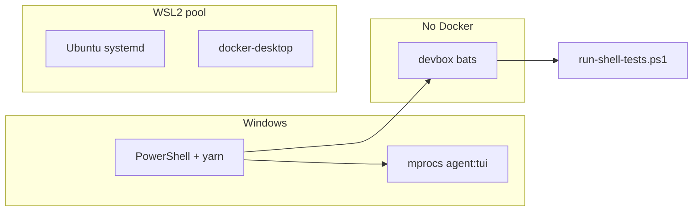

# Windows Docker + WSL2 setup (ModMe)

Resource-tuned guide for **8 GB RAM** machines running ModMe with Docker Desktop, WSL2, devbox, and agent terminal orchestration.

## Quick commands

| Task                       | Command                   |
| -------------------------- | ------------------------- |
| Audit WSL/Docker           | `yarn docker:doctor`      |
| Apply Ubuntu + systemd     | `yarn wsl:ubuntu:setup`   |
| Docker disk cap (10 GB)    | `yarn docker:configure`   |
| Shell tests (no bare bash) | `yarn test:shell`         |
| Agent terminal TUI         | `yarn agent:tui` (mprocs) |
| Prune Docker               | `yarn docker:prune`       |

## Architecture

- **WSL2 kernel backend** for Docker Desktop (not the legacy Hyper-V Docker VM).
- **`.wslconfig`** caps the shared WSL2 utility VM (memory/CPU).
- **Ubuntu WSL** optional for tmux/Linux tooling; **Git Bash** or **devbox** for bats on Windows.
- **direnv** (`.envrc`) loads in WSL/devcontainer only; Windows uses `modme-launch.ps1`.



## microVM.nix analogy

We map [microvm.nix resource options](https://microvm-nix.github.io/microvm.nix/options.html) to Windows controls (intent only — NixOS microVM is not used on Windows):

| microvm.nix            | Windows equivalent                     |
| ---------------------- | -------------------------------------- |
| `microvm.hypervisor`   | Docker **WSL2 engine**                 |
| `microvm.vcpu`         | `.wslconfig` `processors`              |
| `microvm.mem`          | `.wslconfig` `memory`                  |
| `microvm.volumes`      | `docker_data.vhdx` (~10 GB budget)     |
| `microvm.forwardPorts` | Worktree ports + devcontainer forwards |

## `.wslconfig` (8 GB RAM template)

Path: `%USERPROFILE%\.wslconfig`

```ini
[wsl2]
memory=4GB
processors=2
swap=2GB
localhostForwarding=true
guiApplications=false
```

Apply: `wsl --shutdown`, wait 8s, reopen terminals.

**Note:** Some WSL builds do not support `pageReporting`; omit if `wsl` warns about unknown keys.

### Other RAM tiers

| System RAM | `memory` | `processors` |
| ---------- | -------- | ------------ |
| 8 GB       | 4GB      | 2            |
| 16 GB      | 8GB      | 4            |
| 32 GB      | 16GB     | 6            |

Docker + Ubuntu share the pool. Stop Docker when not using containers.

## Docker Desktop

1. **Settings → General** → Use the **WSL 2 based engine** (Hyper-V backend off).
2. **Settings → Resources → WSL Integration** → enable **Ubuntu**.
3. Disk cap: `yarn docker:configure` sets `diskSizeMiB=10240` in `%APPDATA%\Docker\settings-store.json`.
4. Restart Docker Desktop after settings changes.

Verify:

```powershell
docker run --rm hello-world
yarn docker:doctor
```

### Factory reset (reclaim disk)

Only when `ext4.vhdx` / `docker_data.vhdx` grows past ~10 GB:

```powershell
# Quit Docker Desktop
wsl --shutdown
wsl --unregister docker-desktop-data   # if listed
wsl --unregister docker-desktop      # if listed
# Start Docker Desktop — recreates distros
```

Ongoing: `yarn docker:prune`

## Ubuntu WSL + systemd

```powershell
yarn wsl:ubuntu:setup
```

Or manual: `wsl --install -d Ubuntu`, then [`scripts/setup-ubuntu-wsl.ps1`](../scripts/setup-ubuntu-wsl.ps1).

`/etc/wsl.conf` enables `systemd=true` for optional Linux services and tmux workflows.

## Toolchain layering

### devbox (via WSL Ubuntu)

Jetify Devbox is **not** native on Windows. Use WSL (`modme-agent` profile from `yarn wsl:ubuntu:setup`):

```powershell
wsl -d Ubuntu
cd /mnt/c/Users/<you>/Monorepo_ModMe
devbox shell
# or from Windows:
yarn test:shell   # run-shell-tests.ps1 (devbox → Git Bash → WSL)
```

### devcontainer (optional, Docker-heavy)

[`.devcontainer/devcontainer.json`](../.devcontainer/devcontainer.json) uses docker-in-docker. On 8 GB RAM, do not run devcontainer + full forge stack + browser together.

### direnv (WSL / devcontainer)

[`.envrc`](../.envrc) loads devbox shellenv when `devbox` is available. Local overrides: `.envrc.local` (gitignored).

Windows PowerShell does not use direnv — use `yarn session:start` / `yarn launch:health`.

## Agent terminal orchestration

| Tool              | When               | Command                                   |
| ----------------- | ------------------ | ----------------------------------------- |
| **mprocs**        | Primary on Windows | `yarn agent:tui`                          |
| **tmux**          | Optional via WSL   | `yarn worktree:tmux:ps`                   |
| Worktree doctor   | Pre-flight         | `yarn worktree:doctor`                    |
| Docker/WSL doctor | Resource audit     | `yarn worktree:doctor -- -CheckDockerWsl` |

See [agent-terminal-orchestration.md](agent-terminal-orchestration.md) and [multi-agent-worktrees.md](multi-agent-worktrees.md).

## Daily workflow (8 GB)

| Task                  | Docker?                      |
| --------------------- | ---------------------------- |
| `yarn dev:forge:core` | No                           |
| `yarn agent:tui`      | No                           |
| `yarn test:shell`     | No                           |
| `yarn km:verify`      | No                           |
| Devcontainer          | Yes — close other heavy apps |
| Cloud Supabase        | No local DB Docker           |

## Scripts reference

| Script                                                                                      | Purpose                    |
| ------------------------------------------------------------------------------------------- | -------------------------- |
| [`scripts/docker-wsl-doctor.ps1`](../scripts/docker-wsl-doctor.ps1)                         | Audit WSL/Docker/VHDX      |
| [`scripts/configure-docker-wsl-settings.ps1`](../scripts/configure-docker-wsl-settings.ps1) | Disk cap + WSL engine flag |
| [`scripts/setup-ubuntu-wsl.ps1`](../scripts/setup-ubuntu-wsl.ps1)                           | Ubuntu + systemd           |
| [`scripts/run-shell-tests.ps1`](../scripts/run-shell-tests.ps1)                             | devbox/Git Bash/WSL bats   |
| [`scripts/lib/wsl-distros.ps1`](../scripts/lib/wsl-distros.ps1)                             | UTF-16-safe distro parsing |

## Troubleshooting

| Symptom                     | Fix                                                                    |
| --------------------------- | ---------------------------------------------------------------------- |
| `execvpe(/bin/bash) failed` | Use `yarn test:shell` (not raw `bats`); install Git Bash or Ubuntu WSL |
| `VmmemWSL` high RAM         | `wsl --shutdown`; quit Docker; check `.wslconfig`                      |
| Docker pipe not found       | Start Docker Desktop after `wsl --shutdown`                            |
| Unknown `.wslconfig` key    | Remove unsupported keys (e.g. older WSL without `pageReporting`)       |
