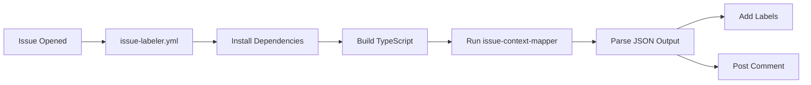

# Knowledge Management Scripts

## 🎯 Purpose

Automated tools for enriching GitHub issues with contextual information using a curated knowledge base.

## 📦 What's Inside

### Core Scripts

| Script | Purpose | Usage |
|--------|---------|-------|
| **issue-context-mapper.ts** | Main knowledge base engine | Called by GitHub Actions |
| **test-kb-mapper.js** | Test suite for KB mappings | `npm test` |
| **sync-docs.js** | Sync toolset docs (existing) | `npm run sync` |
| **generate-diagram.js** | Generate toolset diagrams (existing) | `npm run diagram` |

### Knowledge Base

The `issue-context-mapper.ts` contains a structured knowledge base mapping:
- **Concepts** → **Keywords** → **Files** → **Documentation**
- Supports semantic detection (e.g., "StatCard", "State Sync", "Toolset")
- Auto-suggests labels based on detected concepts

## 🚀 Quick Start

### Installation

```bash
cd scripts/knowledge-management
npm install
```

### Build

```bash
npm run build
```

This compiles TypeScript to `dist/` directory.

### Test Locally

```bash
npm test
```

Expected output:
```
🧪 Testing Knowledge Base Context Mapper

📝 Test Case 1: StatCard component not rendering
────────────────────────────────────────────────────────────
✓ Detected Concepts: StatCard, Agent Tools
✓ Suggested Labels: component-registry, agent
✓ Relevant Files: 2
✓ Documentation Links: 5
✅ PASS

[...]

📊 Test Results: 4 passed, 0 failed
✨ Success Rate: 100%

🎉 All tests passed! Knowledge Base is working correctly.
```

### Manual Testing

```bash
npm run context "Issue title" "Issue body with StatCard and upsert_ui_element"
```

Output (JSON):
```json
{
  "detectedConcepts": ["StatCard", "Agent Tools"],
  "relevantFiles": [
    "src/components/registry/StatCard.tsx",
    "agent/main.py"
  ],
  "documentationLinks": [
    "docs/REFACTORING_PATTERNS.md#component-registry-refactoring"
  ],
  "suggestedLabels": ["component-registry", "agent"],
  "comment": "## 🔍 Detected Context\n\n..."
}
```

## 🏗️ How It Works

### Workflow Integration



### Knowledge Base Structure

```typescript
const KNOWLEDGE_BASE: Record<string, ConceptMapping> = {
  "StatCard": {
    keywords: ["statcard", "stat card", "metric card"],
    files: [{
      path: "src/components/registry/StatCard.tsx",
      description: "StatCard component implementation",
      relatedPaths: ["src/lib/types.ts", "src/app/page.tsx"]
    }],
    documentation: ["docs/REFACTORING_PATTERNS.md"],
    relatedConcepts: ["DataTable", "ChartCard"]
  }
};
```

### Detection Algorithm

1. **Normalize text**: Lowercase title + body
2. **Match keywords**: Search for keyword phrases
3. **Collect mappings**: Aggregate files, docs, labels
4. **Deduplicate**: Remove duplicate entries
5. **Generate comment**: Format as markdown
6. **Output JSON**: Return structured data

## 📖 API Reference

### `analyzeIssueContent(issueBody: string, issueTitle: string): IssueContext`

Analyzes issue and returns detected context.

**Returns**:
```typescript
{
  detectedConcepts: string[];
  relevantFiles: FileMapping[];
  documentationLinks: string[];
  suggestedLabels: string[];
}
```

### `generateContextComment(context: IssueContext): string`

Generates formatted markdown comment.

**Example Output**:
```markdown
## 🔍 Detected Context

This issue appears to be related to:
- **StatCard**
- **Agent Tools**

### 📁 Relevant Files
- [`src/components/registry/StatCard.tsx`](...)
- [`agent/main.py`](...)

### 📚 Documentation
- [docs/REFACTORING_PATTERNS.md](...)
```

## 🔧 Maintenance

### Adding New Concepts

1. **Edit `issue-context-mapper.ts`**:

```typescript
const KNOWLEDGE_BASE: Record<string, ConceptMapping> = {
  // ... existing concepts
  
  "New Concept": {
    keywords: ["keyword1", "keyword2"],
    files: [{
      path: "path/to/file.ts",
      description: "File description"
    }],
    documentation: ["docs/GUIDE.md"],
    relatedConcepts: ["Related Concept"]
  }
};
```

2. **Update label suggestion logic**:

```typescript
if (concept === "New Concept") {
  suggestedLabels.push("new-label");
}
```

3. **Test**:

```bash
npm test
```

4. **Deploy**:

```bash
npm run build
git add .
git commit -m "feat: add New Concept to knowledge base"
```

### Updating File Paths

When files move:

1. Search for old path in `issue-context-mapper.ts`
2. Update `path` and `relatedPaths` fields
3. Run tests to verify
4. Rebuild and deploy

### Monitoring

Check GitHub Actions logs:
- Detected concepts
- Suggested labels
- Comment posting status

**Example log**:
```
KB detected concepts: StatCard, Agent Tools
KB suggested labels: component-registry, agent
Added Knowledge Base context comment
```

## 🧪 Testing

### Test Coverage

- ✅ StatCard detection
- ✅ Toolset deprecation
- ✅ State sync issues
- ✅ ChartCard visualization
- ✅ Label suggestions
- ✅ Comment generation

### Adding Test Cases

Edit `test-kb-mapper.js`:

```javascript
const testCases = [
  // ... existing tests
  {
    title: "New test case",
    body: "Issue body with keywords",
    expectedConcepts: ["Concept1", "Concept2"],
    expectedLabels: ["label1", "label2"]
  }
];
```

Run:
```bash
npm test
```

## 📊 Current Coverage

| Concept | Keywords | Files | Labels |
|---------|----------|-------|--------|
| StatCard | statcard, stat card, metric card | 1 file, 3 related | component-registry |
| DataTable | datatable, data table, table | 1 file, 2 related | component-registry |
| ChartCard | chartcard, chart card, visualization | 1 file, 2 related | component-registry |
| Agent Tools | upsert_ui_element, remove_ui_element | 1 file, 2 related | agent |
| State Sync | state sync, tool_context.state | 2 files, 3 related | state-sync |
| Toolset | toolset, toolsets.json, deprecation | 2 files, 4 related | toolset |
| Frontend | react, next.js, copilotkit | 2 files, 3 related | frontend |
| CI/CD | workflow, github actions | 1 dir, 2 related | ci-cd |
| Testing | test, pytest, jest | 1 dir, 2 related | testing |

**Total**: 9 concepts, 30+ keywords, 15+ files, 9 labels

## 🔗 Related Documentation

- [KNOWLEDGE_BASE_INTEGRATION.md](../../docs/KNOWLEDGE_BASE_INTEGRATION.md) - Full integration guide
- [ISSUE_MANAGEMENT_SYSTEM.md](../../docs/ISSUE_MANAGEMENT_SYSTEM.md) - Issue system overview
- [TOOLSET_MANAGEMENT.md](../../docs/TOOLSET_MANAGEMENT.md) - Toolset lifecycle
- [REFACTORING_PATTERNS.md](../../docs/REFACTORING_PATTERNS.md) - Code patterns

## 📝 Notes

- **No file system scanning**: Pure in-memory lookups (fast!)
- **GitHub Actions friendly**: Runs in ~15 seconds
- **Extensible**: Easy to add new concepts
- **Zero dependencies at runtime**: Only TypeScript for build

## 🚀 Future Enhancements

- [ ] Related issues detection via GitHub API
- [ ] Code snippet extraction from files
- [ ] Dynamic priority scoring
- [ ] Multi-language support
- [ ] Metrics dashboard

---

**Maintained by**: ModMe GenUI Team  
**Version**: 1.0.0  
**Last Updated**: January 3, 2026
