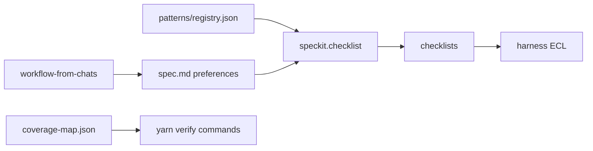

# Plan: Agent Workflow Gates

## Architecture



## Implementation order

1. Fix git hooks path resolution (`install-git-hooks.ps1`, `worktree-doctor.ps1`)
2. Create spec bundle + pattern JSON files
3. Write `research.md` (Turborepo CI + architecture-as-CI mapping)
4. Add `modme-workflow-speckit-bridge` skill + `speckit-pattern-checklist` command
5. Add `run-pattern-gate.mjs` + `pattern-coverage.test.mjs`
6. Wire thermo runbook, migration collection, lean-ctx profile
7. Generate three requirement-quality checklists
8. Run verification matrix

## Files touched

| Action | Path                                                         |
| ------ | ------------------------------------------------------------ |
| Modify | `scripts/install-git-hooks.ps1`                              |
| Modify | `scripts/worktree-doctor.ps1`                                |
| Modify | `scripts/agent-session-finish.ps1`                           |
| Modify | `docs/workflows/thermo-nuclear-dual-monorepo-review.md`      |
| Modify | `scripts/collections/modme-migration-review.collection.json` |
| Modify | `data/lean-ctx-task-profiles.toml`                           |
| Create | `specs/013-agent-workflow-gates/**`                          |
| Create | `.cursor/skills/modme-workflow-speckit-bridge/SKILL.md`      |
| Create | `.cursor/commands/speckit-pattern-checklist.md`              |
| Create | `scripts/lib/run-pattern-gate.mjs`                           |
| Create | `scripts/__tests__/pattern-coverage.test.mjs`                |

## Risks

| Risk                           | Mitigation                                           |
| ------------------------------ | ---------------------------------------------------- |
| Speckit branch naming mismatch | `$env:SPECIFY_FEATURE` documented in quickstart      |
| Composite verify commands      | Map to root `yarn` scripts in coverage-map           |
| Checklist drift from spec      | Re-run `/speckit-pattern-checklist` after spec edits |

## Verification checkpoint

```powershell
yarn hooks:install && yarn worktree:doctor
node --test scripts/__tests__/pattern-coverage.test.mjs
yarn lint:harness && yarn molecule-index:verify
$env:SPECIFY_FEATURE = "013-agent-workflow-gates"
.\.specify\scripts\powershell\check-prerequisites.ps1 -Json
```
